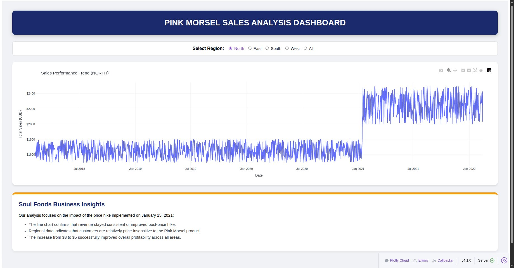

# 🦩 Quantium | Pink Morsel Visualiser

> **Interactive sales analytics dashboard** for the Pink Morsel product line — built as part of the [Quantium Software Engineering Job Simulation](https://www.theforage.com/simulations/quantium/software-engineering-hnd4) on Forage.


---

## 📌 Overview

This project implements a full **data processing pipeline** and an **interactive Plotly Dash dashboard** to analyse Pink Morsel sales trends over time. A key analytical focus is customer price sensitivity across regions following the **price hike on January 15, 2021**.

The dashboard allows stakeholders to filter sales data by region and visually compare performance before and after the pricing change — enabling data-driven decisions on retail strategy.



---

## ✨ Features

| Feature | Description |
| --- | --- |
| 🧹 **Data Wrangling** | Automated cleaning of messy CSV data — strips symbols, handles nulls, and casts types |
| 📊 **Interactive Dashboard** | Region-based filtering via Dash callbacks with a responsive, polished UI |
| 🧪 **Testing Suite** | Unit and functional tests using **Pytest** and **Selenium WebDriver** |
| 🐳 **Docker Support** | Fully containerised environment — no local Python setup required |
| ⚙️ **CI/CD Ready** | Automated Bash scripts for pipeline execution and test automation |

---

## 🗂️ Project Structure

```
quantium-pink-morsel/
├── app.py                  # Main Dash application entry point
├── data/
│   └── pink_morsel.csv     # Raw sales data (multi-region)
├── tests/
│   ├── test_components.py  # Unit tests — header, graph, picker render
│   └── test_callbacks.py   # Functional tests — region filter callbacks
├── Dockerfile              # Container definition
├── run_tests.sh            # Automated test runner script
├── requirements.txt        # Python dependencies
└── README.md
```

---

## 🚀 Setup & Execution

### Option 1 — Docker (Recommended)

No Python or dependency installation needed locally.

```bash
# Build the Docker image
docker build -t quantium-automation .

# Run the automated test suite
docker run quantium-automation
```

### Option 2 — Local Setup

1. Activate the virtual environment

```bash
# Windows
.\venv\Scripts\activate

# Linux / macOS
source venv/bin/activate
```

**2. Install dependencies**

```bash
pip install -r requirements.txt
```

**3. Run the automated tests**

```bash
chmod +x run_tests.sh
./run_tests.sh
```

**4. Launch the dashboard**

```bash
python app.py
```

Then open your browser and navigate to: **[http://127.0.0.1:8050/](http://127.0.0.1:8050/)**

---

## 🧪 Testing Strategy

The test suite validates the reliability of the dashboard at multiple levels:

- **Component Rendering** — Confirms the Header, Graph, and Region Picker components mount without errors.
- **Callback Functionality** — Verifies that selecting a region updates the visualisation correctly.
- **Environment Stability** — Ensures the app runs consistently across local and containerised environments, keeping it CI-pipeline-ready.

Tests are executed via **Pytest** with **Selenium** for browser-level functional testing.

---

## 📊 Business Insights

The dashboard tracks **Pink Morsel unit sales** across four regions:

| Region | Coverage |
|---|---|
| 🔵 North | Northern distribution zone |
| 🔴 South | Southern distribution zone |
| 🟢 East | Eastern distribution zone |
| 🟡 West | Western distribution zone |

A vertical marker at **January 15, 2021** delineates the pre- and post-price-hike periods, allowing analysts to assess:

- The **immediate impact** of the price change on sales volume
- **Regional variation** in customer price sensitivity
- Long-term **sales trajectory** and recovery trends by region

---

## 🛠️ Tech Stack

- **[Plotly Dash](https://dash.plotly.com/)** — Interactive web dashboard framework
- **Pandas** — Data manipulation and cleaning
- **Pytest** — Unit and integration testing
- **Selenium** — Browser-level functional testing
- **Docker** — Containerisation and environment consistency
- **Bash** — CI/CD automation scripts

---

## 📜 Certification

This project was completed as part of the **Quantium Software Engineering Job Simulation** hosted on [Forage](https://www.theforage.com/).

**Certified by:** Forage & Quantium
**Issued:** May 15, 2026

---

## 📄 License

This project is for educational and portfolio purposes as part of the Quantium Forage simulation. All data used is provided by the simulation and is not proprietary to Quantium.
